# 🚆 Flutter Railway App

A feature-rich mobile application built with Flutter for seamless train ticket booking, wallet management, and travel scheduling.

---

## ✨ Features

- 🎫 Fast & easy train ticket booking
- 💳 Integrated wallet with UPI & QR payment support
- 📅 Train schedules & live updates
- 📬 Inbox with messages and notifications
- 🎟️ E-ticket management (view, edit, download)
- 🏷️ Monthly pass support
- 👤 User profile management

---

## 📱 Application Flow

### 🔍 Search & Source Selection
<p align="center">
  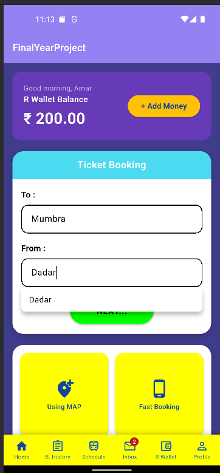
  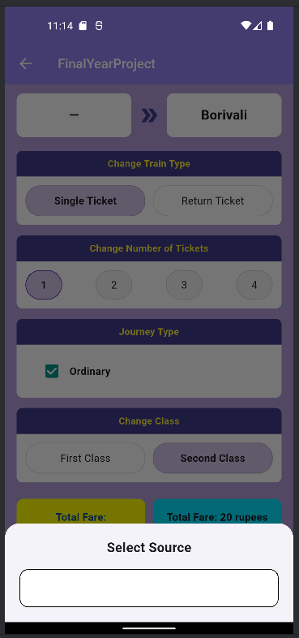
  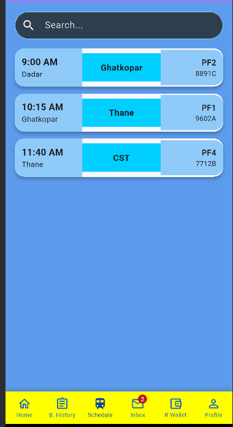
</p>

---

### ⚡ Booking Process
<p align="center">
  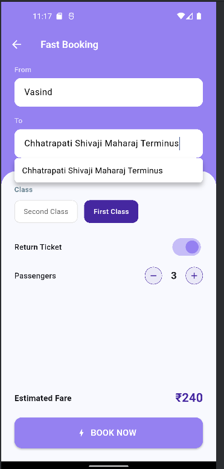
  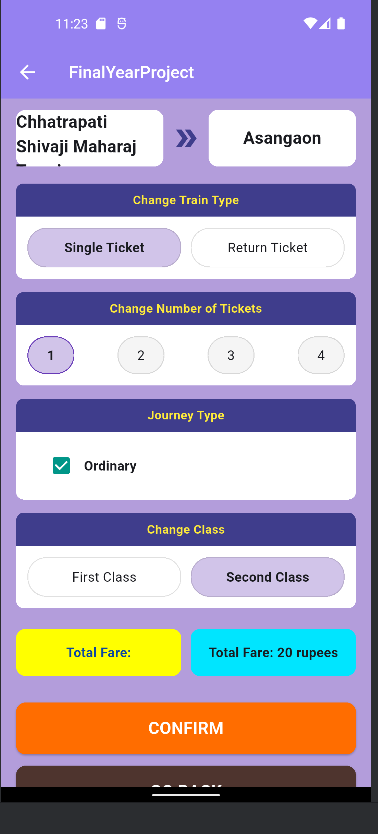
  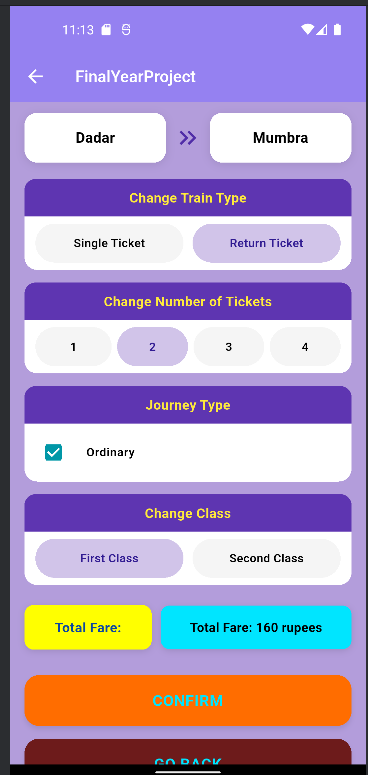
</p>
<p align="center">
  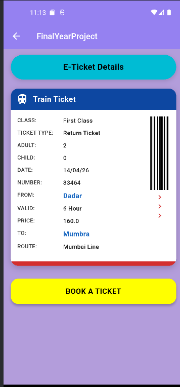
  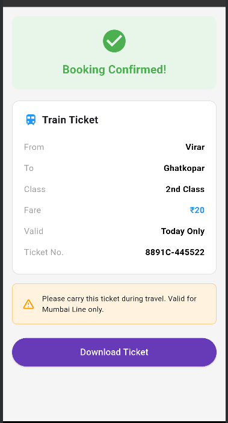
</p>

---

### 💰 Payment
<p align="center">
  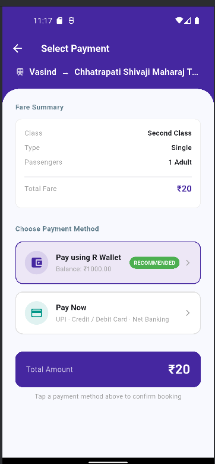
  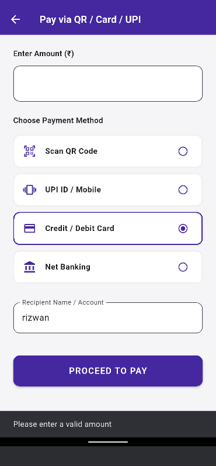
  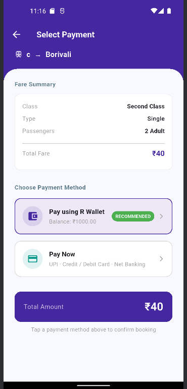
</p>
<p align="center">
  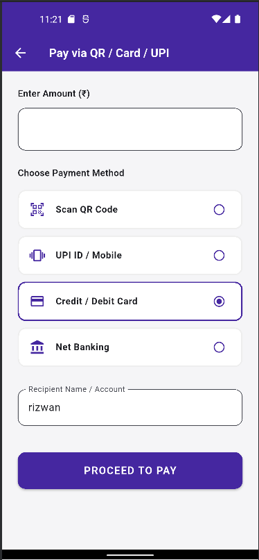
  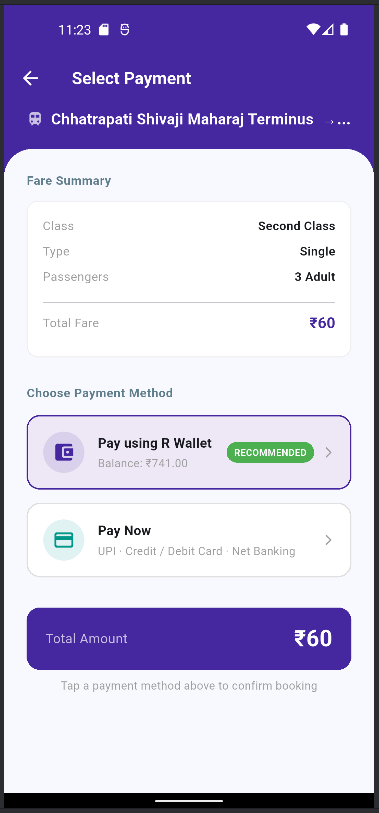
  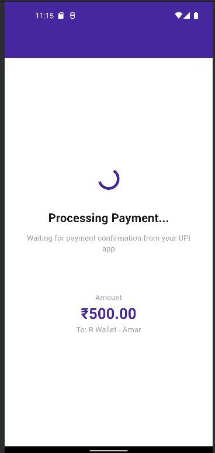
</p>
<p align="center">
  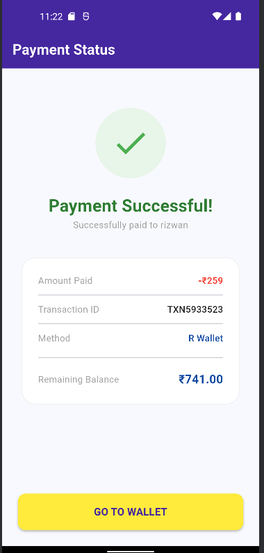
</p>

---

### 📲 QR Code Payments
<p align="center">
  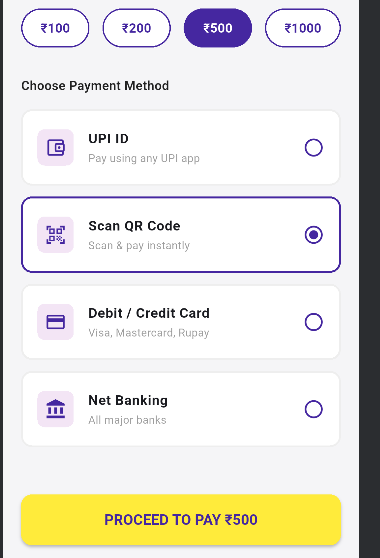
  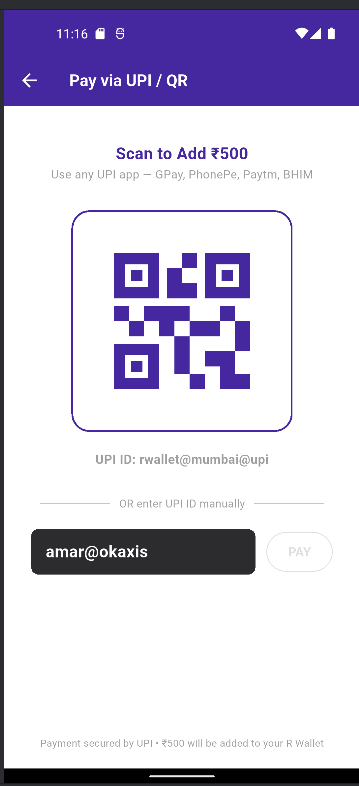
  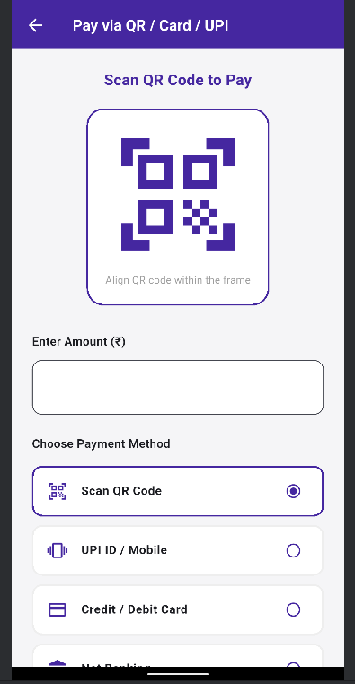
</p>

---

### 🎟️ E-Ticket & Pass Management
<p align="center">
  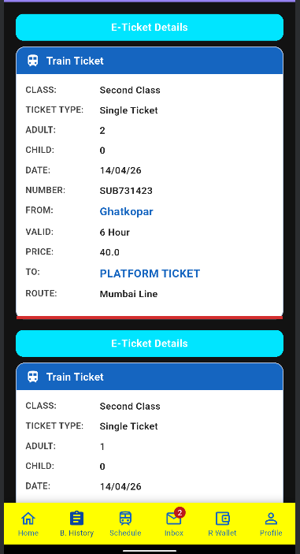
  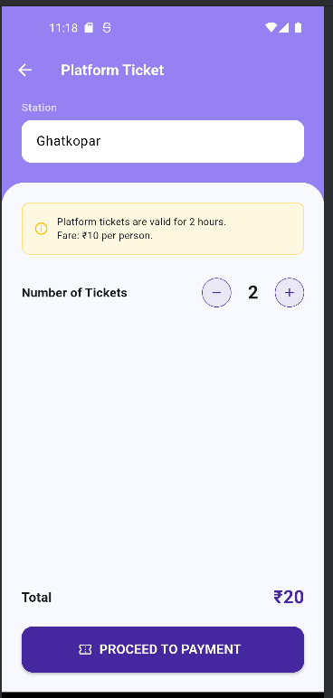
  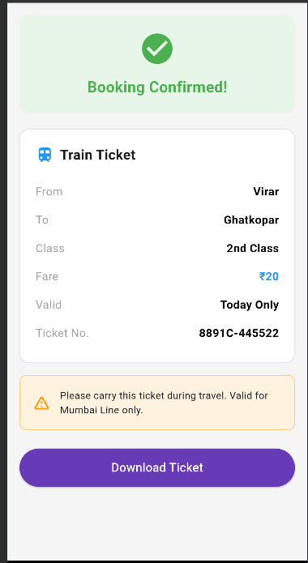
</p>
<p align="center">
  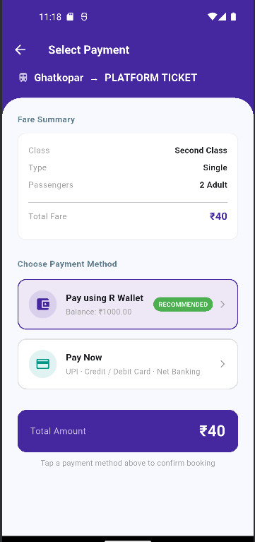
  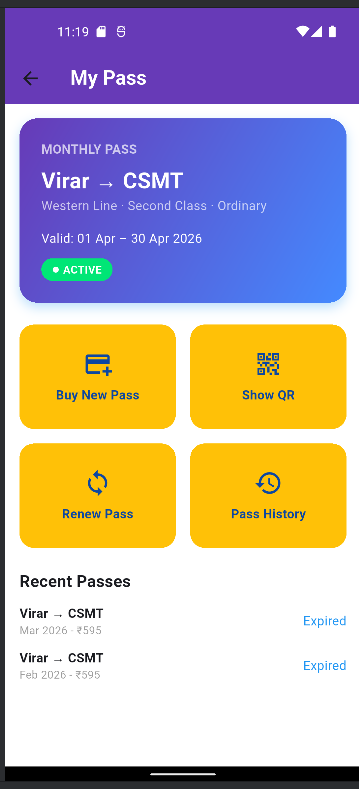
  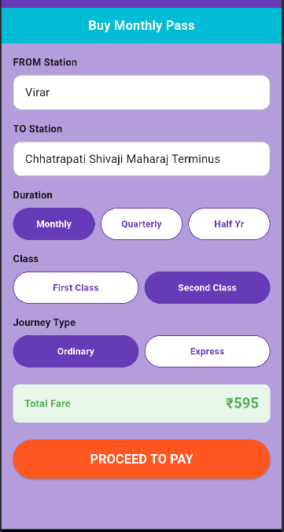
</p>

---

### 👛 Wallet
<p align="center">
  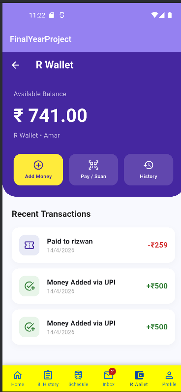
  
  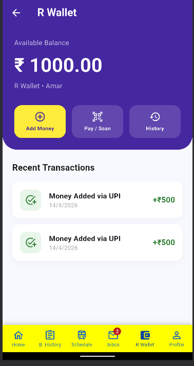
</p>
<p align="center">
  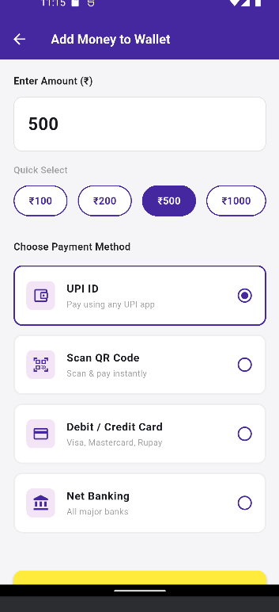
  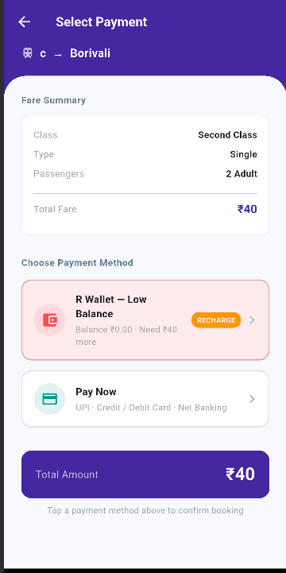
  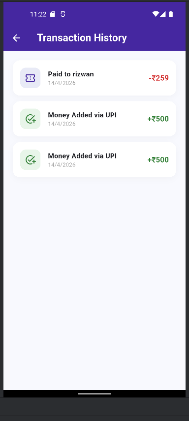
</p>

---

### 📬 Inbox & Updates
<p align="center">
  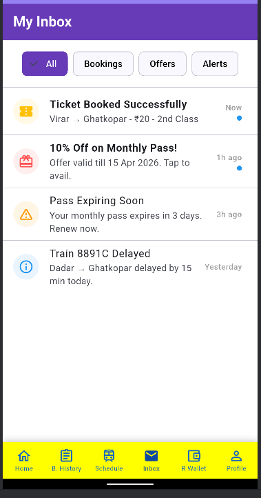
  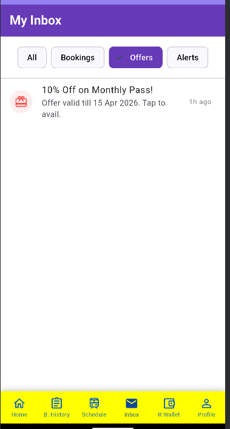
  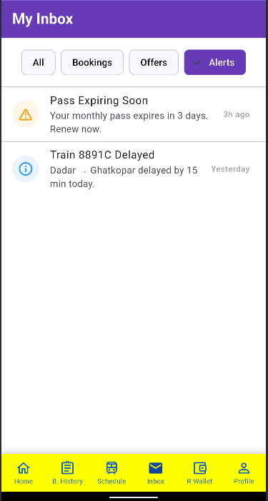
</p>
<p align="center">
  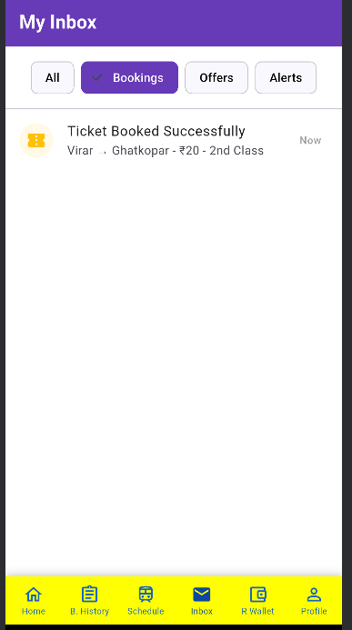
</p>

---

### 👤 Profile
<p align="center">
  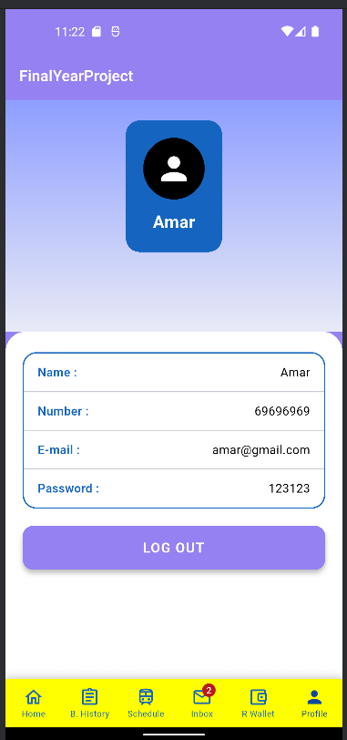
</p>

---

## 🛠️ Tech Stack

| Technology | Usage |
|---|---|
| Flutter | Cross-platform UI framework |
| Dart | Programming language |
| Firebase / REST API | Backend & authentication |
| QR Code | Ticket & payment scanning |

---

## 🚀 Getting Started

### Prerequisites

- Flutter SDK `>=3.0.0`
- Dart SDK `>=3.0.0`
- Android Studio / VS Code

### Installation

```bash
# Clone the repository
git clone https://github.com/your-username/FlutterRailwayApp.git

# Navigate to the project directory
cd FlutterRailwayApp

# Install dependencies
flutter pub get

# Run the app
flutter run
```

---

## 📁 Project Structure

```
FlutterRailwayApp/
├── assets/
│   └── screenshots/
├── lib/
│   ├── main.dart
│   ├── screens/
│   ├── widgets/
│   └── models/
├── pubspec.yaml
└── README.md
```

---

## License

This project is licensed under the MIT License. See the [LICENSE](LICENSE) file for details.

---

##  Contributing

Contributions, issues, and feature requests are welcome! Feel free to open a pull request or issue.

---

<p align="center">Made using Flutter</p>
